Postman を使ったAPIテストの基本機能を Postman 内でリクエストのお試しができるサービス [Postman Echo](https://learning.postman.com/docs/developer/echo-api/) を例として説明する。

## コレクションの作成

左上の ``新規`` をクリックし、表示される選択肢から ``コレクション`` を選ぶ。

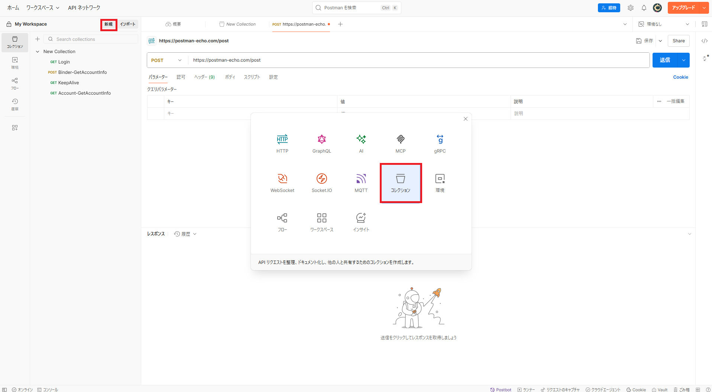

「新しいコレクション」という名前でコレクションが作成されたことを確認し、``リクエストを追加`` をクリックする。

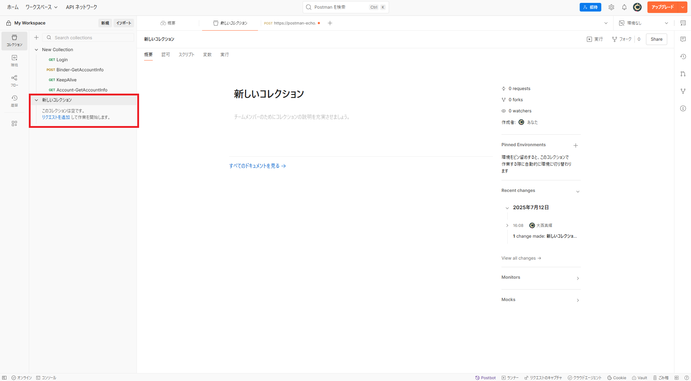

## リクエストの作成

HTTP リクエストメソッドとして ``POST`` を選択し、URL として https://postman-echo.com/post を入力する。
https://postman-echo.com/post では、ボディ内に記載した内容がレスポンスで返ってくる仕様になっている。
   
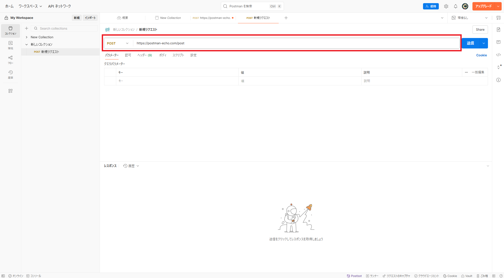

``ボディ`` 内の ``Raw`` を選択し、以下の内容を記載する。

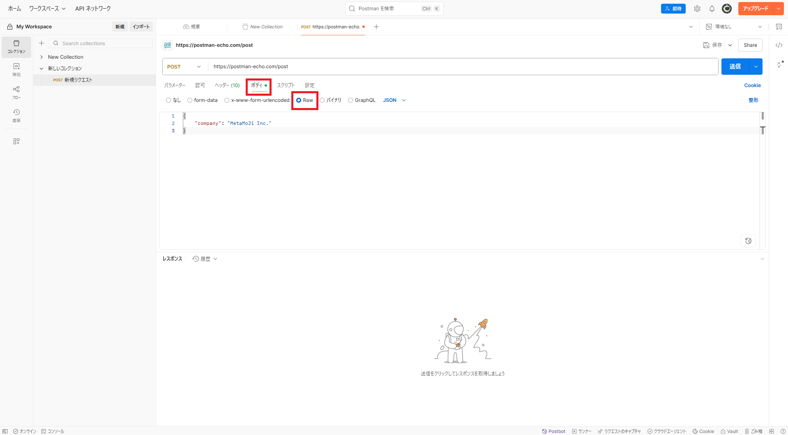

```json
{
  "company":"MetaMoJi Inc."
}
```

## テストスクリプトの作成

``スクリプト`` 内の ``Post-response`` をクリックし、以下の内容を記載する。

```javascript
// レスポンスヘッダーの内容をテストするための記述
pm.test("レスポンスヘッダーのテスト", function () {
    pm.expect(pm.response.headers.get("Content-Length")).to.exist;
    pm.expect(pm.response.headers.get('Content-Type')).to.include('application/json');
});

// レスポンスボディ内の内容をテストするための記述
pm.test("レスポンスボディ内の値をテスト", function () {
    const data = pm.response.json().data;
    pm.expect(data.company).to.equal("MetaMoJi Inc.");
});

// レスポンスのJsonスキーマをテストするための記述
const expectedSchema = {
    "type": "object",
    "properties": {
        "data": {
            "type": "object",
            "properties": {
                "comany": {
                    "type": "string"
                }
            }
        }
    }
};
pm.test('JSONスキーマのテスト', function () {
    pm.response.to.have.jsonSchema(expectedSchema);
});
```

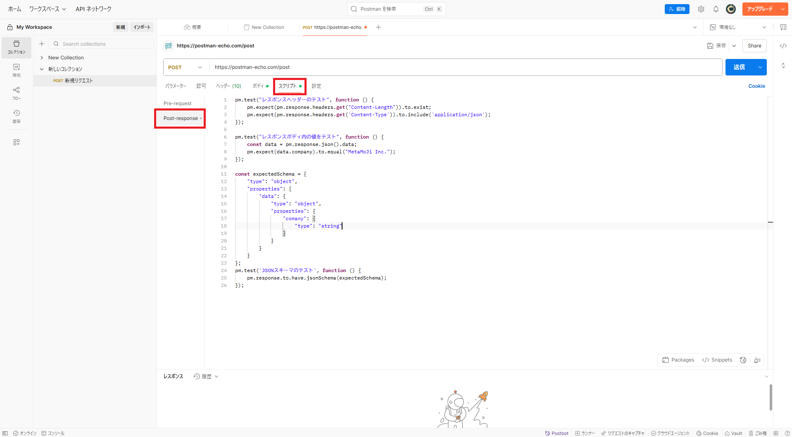

## リクエストの実行とテスト結果の確認

画面右上の ``送信`` をクリックし、リクエストを実行する。
すると、画面下半分にリクエスト実行結果が表示される。
実行結果の中から ``ボディ`` を選択し、レスポンス結果が表示される。

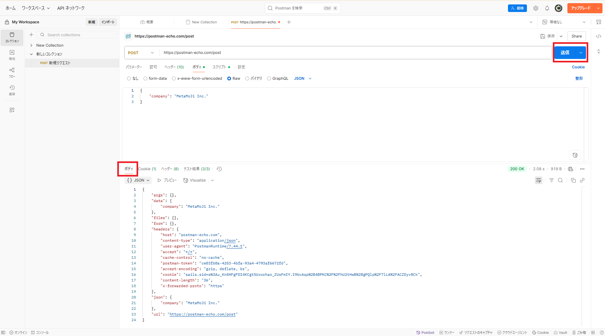

レスポンス結果の中から ``テスト結果`` をクリックし、先ほど記載したテストが実行されていることを確認する。
「合格」であればテストケースが期待値と一致しており、「不合格」であれば期待された結果ではないことを示す。

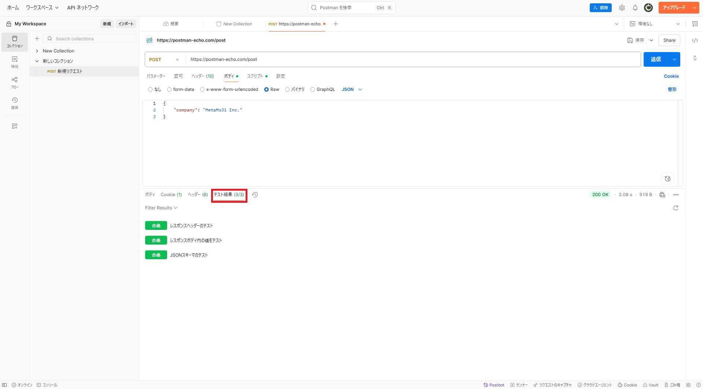

## 変数の使用

変数を使用することで環境ごとに異なるURLを指定したり、リクエストに与えるパラメータを変更したりすることができる。以下に使用可能な変数の一覧を示す。

| スコープ| 説明|
|-|-|
| グローバル | コレクション、リクエスト、テストスクリプト、環境の間でデータにアクセスできるワークスペース全体の変数。テストやプロトタイピングに適する。 |
| コレクション | 特定のコレクション内の全リクエストで使用でき、環境には依存しない変数。認証や URL 詳細など、単一環境で使う情報の管理に適する。 |
| 環境 | ローカル開発／テスト／運用など、用途ごとに切り替えて使える変数。アクティブ化できる環境は１つのみ。環境ごとにロールベースのアクセス制御を設定可能。 |
| データ | 外部 CSV／JSON ファイルから読み込まれ、Newman や Collection Runner 実行時にデータセットを定義する変数。実行中のみ現在の値を保持し、終了後はクリアされる。 |
| ローカル | リクエストスクリプト内の一時変数で、単一リクエストまたはコレクション実行中のみ有効。全スコープをオーバーライドする値が必要だが、実行後に値を保持したくない場合に適する。 |

> **補足:** 同じ名前の変数が複数のスコープで宣言されている場合、より狭いスコープ（ローカル→データ→環境→コレクション→グローバル）の値が優先される。

ここからは、以下の流れで [リクエストの実行とテスト結果の確認](#リクエストの実行とテスト結果の確認) と同様のリクエストを変数を使用して実行し、結果が同じになることを確認していく。

1. 環境（Test）を作成

    左サイドバーに存在する ``環境`` をクリックし、``+`` をクリックする。
    すると、「新しい環境」という名前で環境が作成される。

    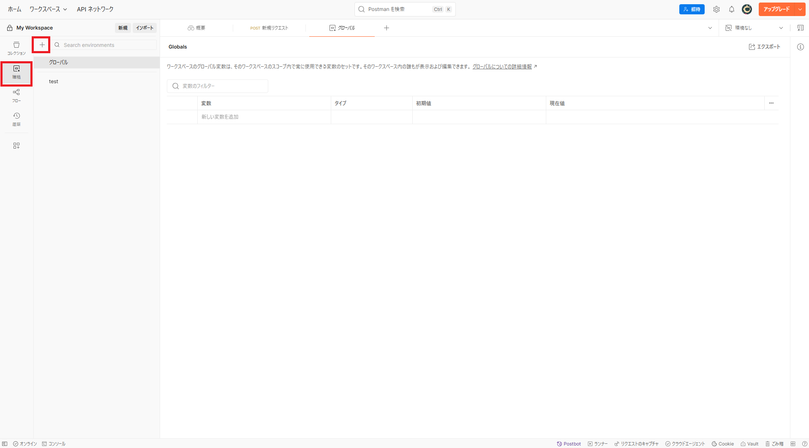

    「新しい環境」の横にある ``･･･`` をクリックし、`` 名前の変更 `` から環境名を「Test」に変更する 

    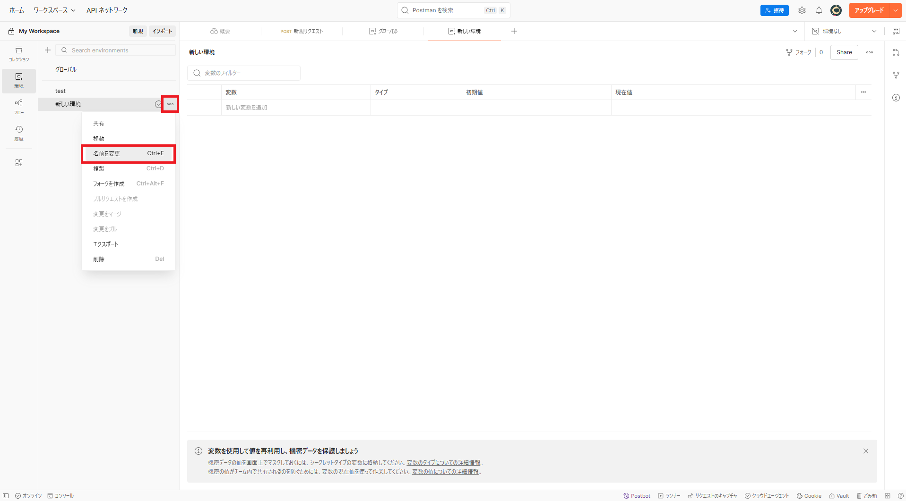

2. https://postman-echo.com を環境変数 baseUrl として設定

    変数：baseUrl、タイプ：デフォルト、初期値：https://postman-echo.com、現在値：https://postman-echo.com を設定する
    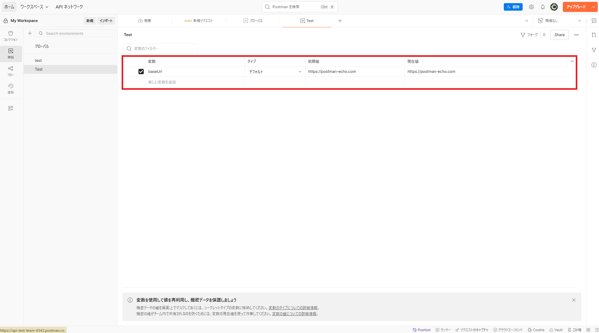

3. リクエストの実行環境を Test に変更

    右上にある ``環境なし`` と表示されている箇所をクリックし、表示される環境一覧から「Test」を選択する

    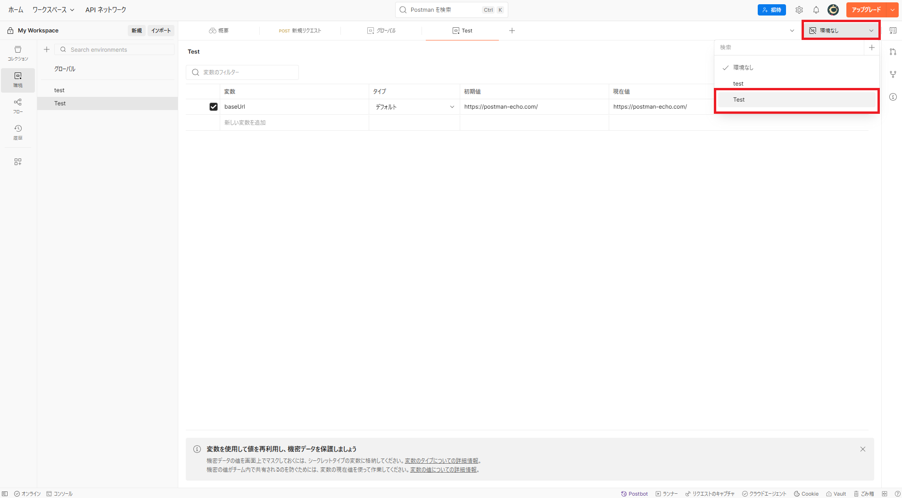
4. リクエストの URL を環境変数に変更

    左サイドバーにある ``コレクション`` から「新規リクエスト」をクリックする。
    そして、リクエスト先として記載されている https://postman-echo.com を {{baseUrl}}/post に変更する。

    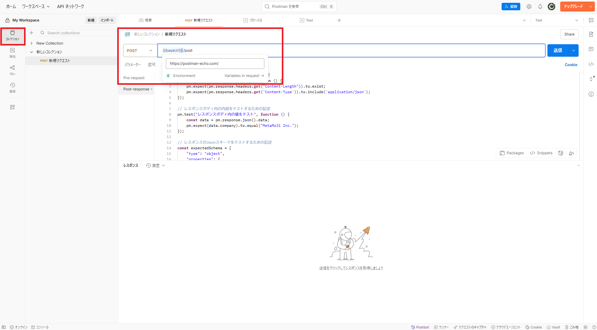
5. リクエストを実行し、レスポンスを確認

    ``送信`` をクリックし、リクエストを実行する。
    その後、リクエスト結果として下画面に「ボディ」や「テスト結果」が表示される。
    表示された結果を見ると、[リクエストの実行とテスト結果の確認](#リクエストの実行とテスト結果の確認)と同様であることがわかる。

    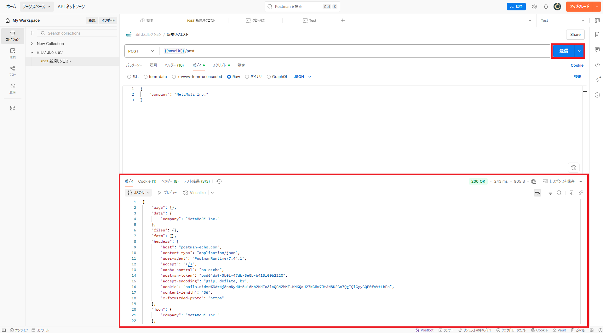