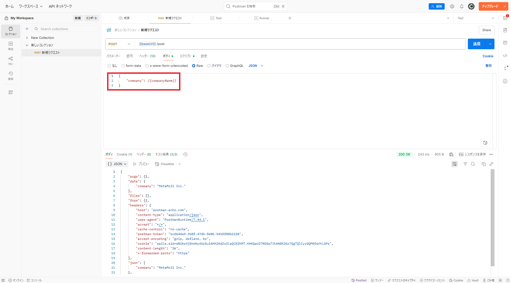
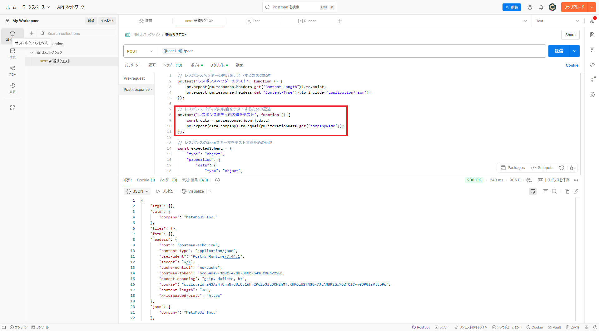
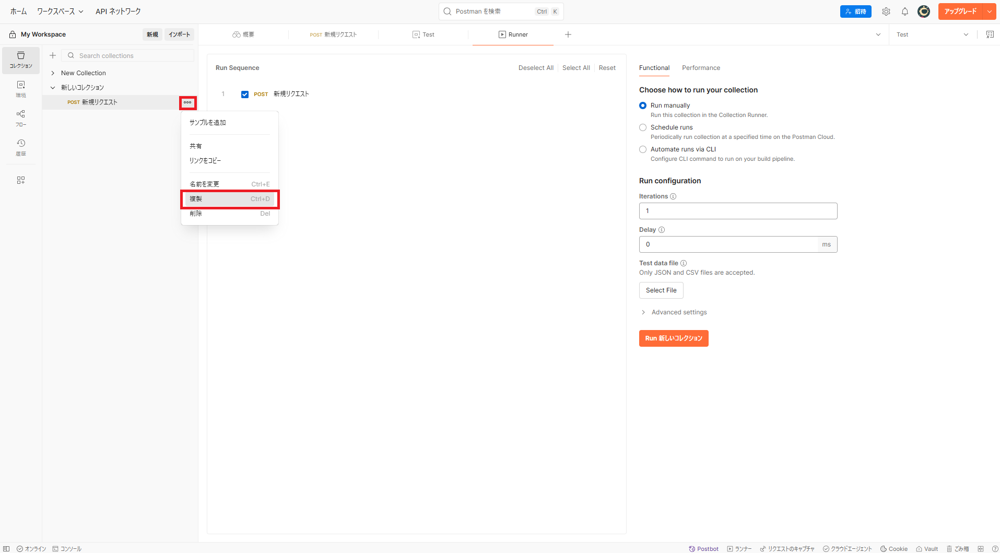
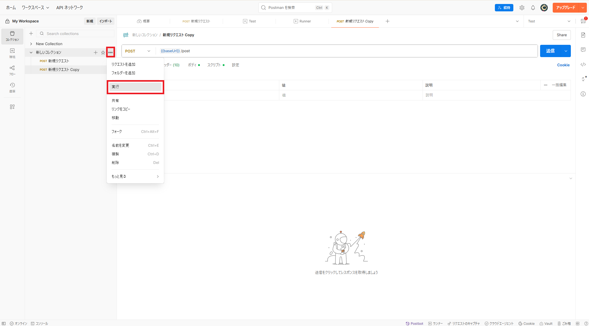
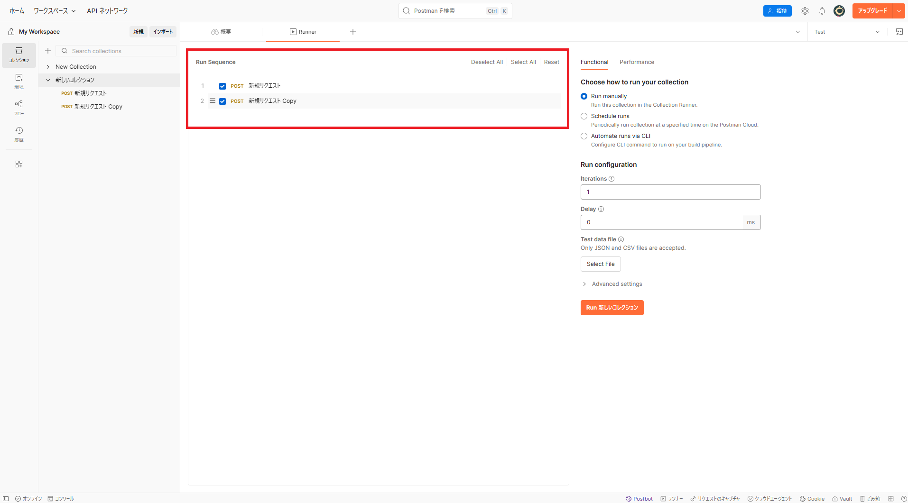

これまでは、手動でリクエストを実行した。しかし、リクエストの数やパラメータの数が増加してくると手動での実行は時間がかかる。そこで、本セクションでは、「Collection Runner」 を用いたリクエストの自動実行を実現する操作を説明する。

## 事前準備

本題の説明に入る前に準備をする。その理由については後ほど説明するため、ここでは割愛する。

「新規リクエスト」 のボディの 「company」 の値を変数 「companyName」 に置き換える



`` スクリプト `` の ``Post-response`` 内のレスポンスボディ内の値をテストするスクリプトを以下に示す記述に置き換える

```javascript
// レスポンスボディ内の内容をテストするための記述
pm.test("レスポンスボディ内の値をテスト", function () {
    const data = pm.response.json().data;
    pm.expect(data.company).to.equal(pm.iterationData.get("companyName"));
});
```



「新規リクエスト」の右側にある ```･･･``` から ```複製``` をクリックし、「新規リクエスト Copy」を作成する



## Collection Runner 画面

「新しいコレクション」の右にある ``･･･`` から ``実行`` をクリックし、Collection Runner 画面へと移る



## 実行するリクエストの選択と順序

Collection Runner では、実行するリクエストの選択や順序を組み替えることができる。
「新規リクエスト」のみを実行したい場合は、「新規リクエスト Copy」の左にあるチェックマークを外せばよい。一方、「新規リクエスト」と「新規リクエスト Copy」の実行順序を入れ替えたい場合は、「新規リクエスト Copy」の左側にある ```ハンバーガーアイコン``` をクリックした状態で、「新規リクエスト」の上までドラッグする。



## Funcitonal（機能）テスト

Collection Runner の **Functional** タブでは、選択したコレクション内のリクエストを順番に実行し、テストスクリプトを使って API の機能検証を自動化できる

- **Run manually**

    Collection Runner 上で ``Run`` ボタンをクリックし、その場でコレクションを実行する
  - 開発中の動作確認やデバッグに最適  
  - Iterations（反復回数）や Delay（リクエスト間の遅延）を都度設定可能

- **Schedule runs（定期実行）**  

    Postman Cloud 上で実行スケジュールを設定し、自動的にコレクションを実行
  - 毎日／毎週／指定日時での定期テストに便利
  - 実行結果はダッシュボードで履歴として管理・共有可能  

- **Automate runs via CLI（CLI 自動実行）**  
  
    Postman CLI（Postman の公式 CLI）用のコマンドを生成し、コマンドラインや CI/CD パイプライン（Jenkins、GitHub Actions など）からコレクションを実行
  - スクリプトやビルド環境に組み込むことで、テストの完全自動化を実現
  - 結果は標準出力／ファイル出力に対応し、CI のパス／フェイル条件を設定可能


### Run manually の実行

### Schedule Run の実行

### Automate runs via CLI の実行

## Performance（性能）テスト

Collection Runner の **Performance** タブを使うと、同じコレクションを複数の仮想ユーザーで並列実行し、実際のトラフィックをシミュレートして API のパフォーマンスを計測できる
