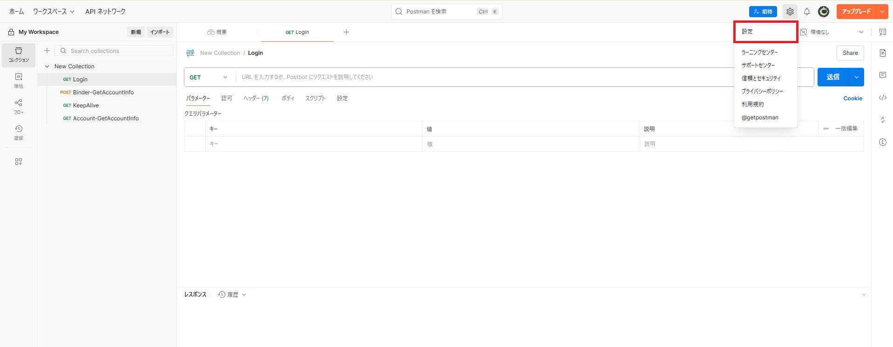
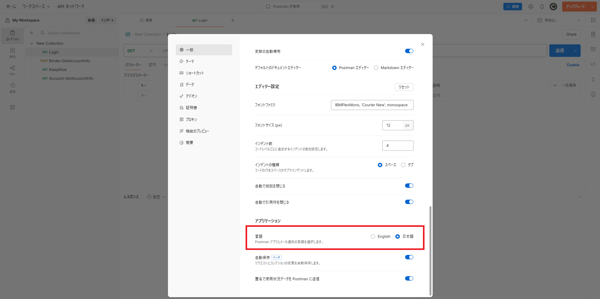

## 利用環境

Web版とデスクトップ版の両方が存在する。APIの Peformance（性能） をテストする際には、デスクトップ版での実行となるため、デスクトップ版の使用をオススメする。

Web 版：https://identity.getpostman.com/login

デスクトップ版：https://www.postman.com/downloads/

## 言語設定

アプリ画面右上から Settings（設定）を開く
  

General（一般）から Application（アプリケーション）内の Language（言語）で日本語を選択する

