これまでは、手動でリクエストを実行した。しかし、リクエストの数やパラメータの数が増加してくると手動での実行は時間がかかる。そこで、本セクションでは、「Collection Runner」 を用いたリクエストの自動実行を実現する操作を説明する。

## 事前準備

### データファイルの作成

APIのテストを行うにあたり、リクエストを様々なパターンで実行したいと考えるはずだ。
これは、様々なパターンのパラメータを記載したデータファイルをコレクションの実行時に読み込ませることで可能となる。
以下の内容のデータファイルを tutorial.csv として保存しておく。
データファイルの 1 行が 1 回の Iteration に対応しており、以下のデータファイルでは 3 回の Iteration でそれぞれ異なる値が代入されるようになる。

| companyName |
| -- |
| MetaMoJi Inc. |
| Sample Inc. |
| Test Inc. |

### リクエストのボディの内容の一部を変数に変更

「新規リクエスト」 のボディの 「company」 の値を変数 「companyName」 に置き換える。
これにより、コレクション実行時にデータファイルから変数「companyName」と一致する変数に値が代入されるようになる。
> **注意:** "{{companyName}}" とダブルクォーテーションで囲むようにする

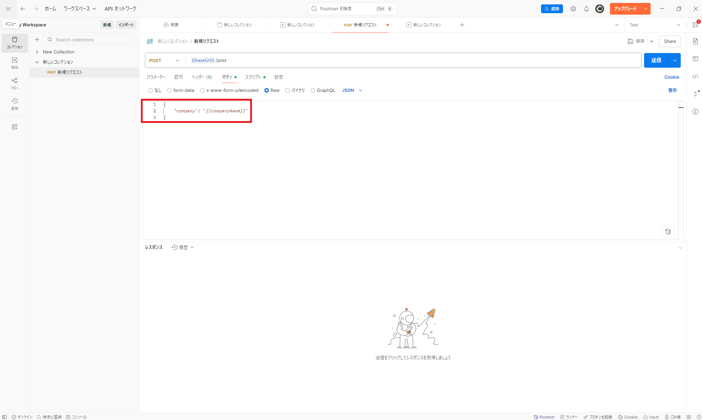

`スクリプト` の `Post-response` 内のレスポンスボディ内の値をテストするスクリプトを以下に示す記述に置き換える。
pm.iterrationData.get("companyName") は、データファイルからcompanyNameを取得するための記述である。

```javascript
// レスポンスボディ内の内容をテストするための記述
pm.test("レスポンスボディ内の値をテスト", function () {
    const data = pm.response.json().data;
    pm.expect(data.company).to.equal(pm.iterationData.get("companyName"));
});
```


コレクション実行では複数のリクエストを順序に沿って実行することができる。
順序の決定方法は、後の[実行するリクエストの選択と順序](#実行するリクエストの選択と順序)で詳しく説明する。
リクエストの数を増やすために、「新規リクエスト」の右側にある `･･･` から `複製` をクリックし、「新規リクエスト Copy」を作成する。

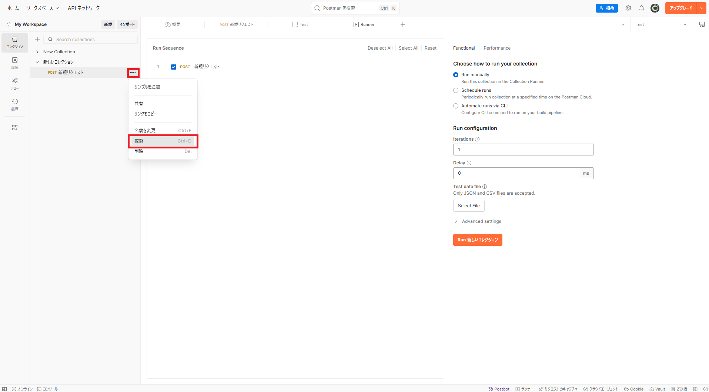

## Collection Runner 画面

「新しいコレクション」の右にある `･･･` から `実行` をクリックし、Collection Runner 画面へと移る


## 実行するリクエストの選択と順序

Collection Runner では、実行するリクエストの選択や順序を組み替えることができる。
「新規リクエスト」のみを実行したい場合は、「新規リクエスト Copy」の左にあるチェックマークを外せばよい。一方、「新規リクエスト」と「新規リクエスト Copy」の実行順序を入れ替えたい場合は、「新規リクエスト Copy」の左側にある `ハンバーガーアイコン` をクリックした状態で、「新規リクエスト」の上までドラッグする。


## Funcitonal（機能）テスト

Collection Runner の **Functional** タブでは、選択したコレクション内のリクエストを順番に実行し、テストスクリプトを使って API の機能検証を自動化できる

- **Run manually**

    Collection Runner 上で `Run` ボタンをクリックし、その場でコレクションを実行する
  - 開発中の動作確認やデバッグに最適  
  - Iterations（反復回数）や Delay（リクエスト間の遅延）を都度設定可能

- **Schedule runs（定期実行）**  

    Postman Cloud 上で実行スケジュールを設定し、自動的にコレクションを実行
  - 毎日／毎週／指定日時での定期テストに便利
  - 実行結果はダッシュボードで履歴として管理・共有可能  

- **Automate runs via CLI（CLI 自動実行）**  
  
    Postman CLI（Postman の公式 CLI）用のコマンドを生成し、コマンドラインや CI/CD パイプライン（Jenkins、GitHub Actions など）からコレクションを実行
  - スクリプトやビルド環境に組み込むことで、テストの完全自動化を実現
  - 結果は標準出力／ファイル出力に対応し、CI の成功／失敗条件を設定可能

### Run manually の実行

`Functional` をクリックし、コレクションの実行方法として `Run manually` を選択する


実行の設定として、Iterations に 3 を設定する。
そして、`Select File` をクリックし、[事前準備](#事前準備)で作成した 「tutorial.csv」　を選択する。


Preview 画面で読み込まれたデータファイルが CSV であることと読み込まれた内容が元のデータファイルと一致していることを確認し、`Use localy` をクリックする。
> **補足:** `Upload to Workspace` を選択した場合、Postman Cloud上にアップロードされる。次回コレクションを実行する際に、アップロードされたデータファイルを使用することができる。

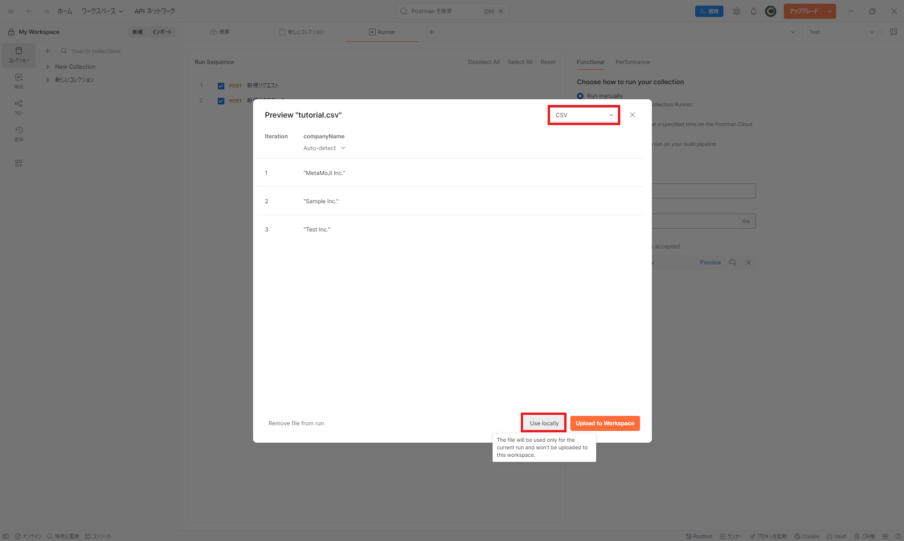

`Run 新しいコレクション` をクリックし、コレクションを実行する

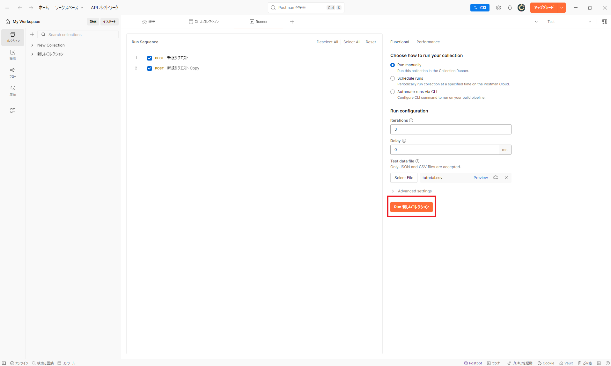

実行の結果が表示されるので、各 Iteration ごとに変数に代入されるパラメータが異なり、それによってレスポンスも異なっていることを確認する

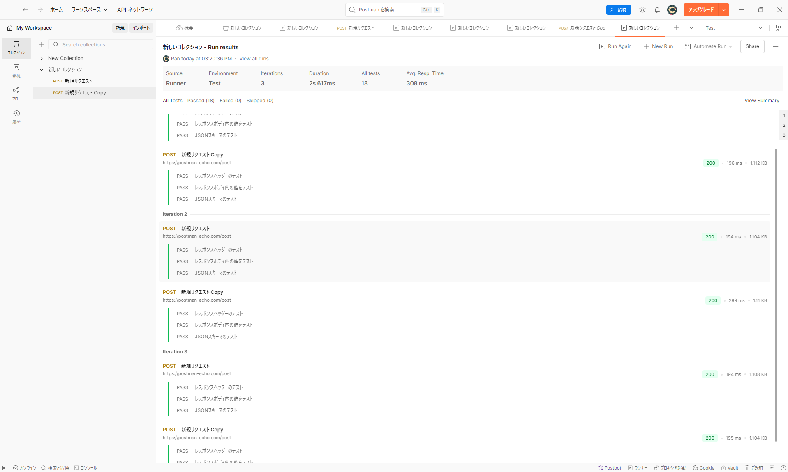

### Schedule runs の実行

`Functional` をクリックし、コレクションの実行方法として `Schedule runs` を選択する


スケジュールの設定および実行の設定を以下のように設定する。

| 項目 | 設定内容 |
| -- | -- |
| Schedule Name | test run |
| Run Frequency | 時タイマー、1 時間毎 |
| Enviroment | Test |
| Iterations | 3 |
| Select file | tutorial.csv |

> **補足:** Run Frequency では、分タイマー、時タイマー、週タイマーを設定できる。しかし、無料版では分タイマーは設定できない。

メールの通知の設定では、コレクションの実行が失敗した場合に通知するユーザーの指定と何回連続で失敗した場合に通知を止めるかを設定できる。今回はデフォルト値を使用する。

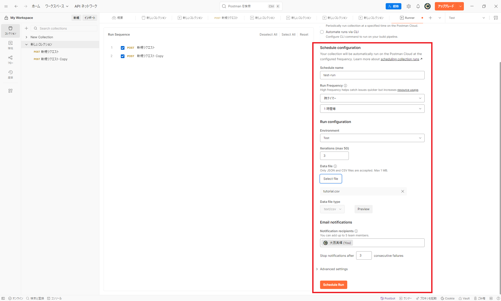

`Schedule run` をクリックし、コレクションを設定したスケジュールで実行する


スケジュールが設定され、１時間毎にコレクション実行されるようになる

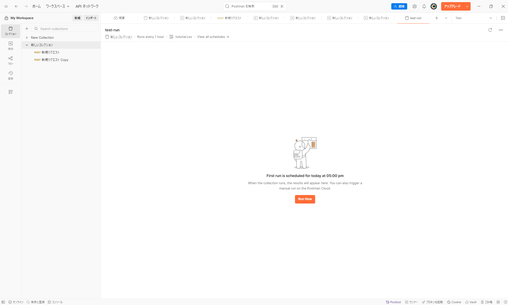

スケジュール通りに実行された場合の結果を以下に示す


スケジューリングされたコレクションの実行を削除する方法を説明する。
スケジューリングを設定したコレクションを選択し、`実行` -> `スケジュール` とクリックする。
すると、さきほど設定した「test-run」が表示されるので、`･･･` から `削除` を選択することで当該設定を削除できる。


### Automate runs via CLI の実行

`Functional` をクリックし、`Automate runs via CLI` を選択する

#### CLI 上での実行


コレクションを CLI で実行するために、Postman CLI をインストールする必要がある。

「Run on Postman CLI」の項目にある [Install Postman CLI](https://learning.postman.com/docs/postman-cli/postman-cli-installation/#windows-installation) のリンクをクリックする。


リンク先から自身の実行環境に応じてインストールを行う。
筆者は WSL（Windows Subsystem for Linux） 上で実行するため、Linux環境でインストールを行う。


コマンドライン上で以下のコマンドを実行する。

```bash
curl -o- "https://dl-cli.pstmn.io/install/linux64.sh" | sh
```

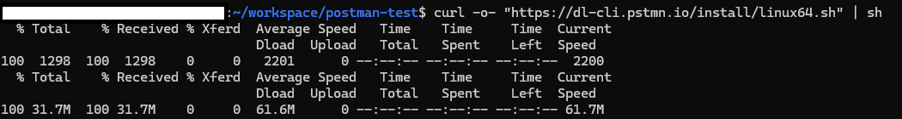

Postmanの画面に戻り、`Add API Key`をクリックして `Generate Key` を選択する


API key の名前として test-cli と入力し、`Generate` をクリックする

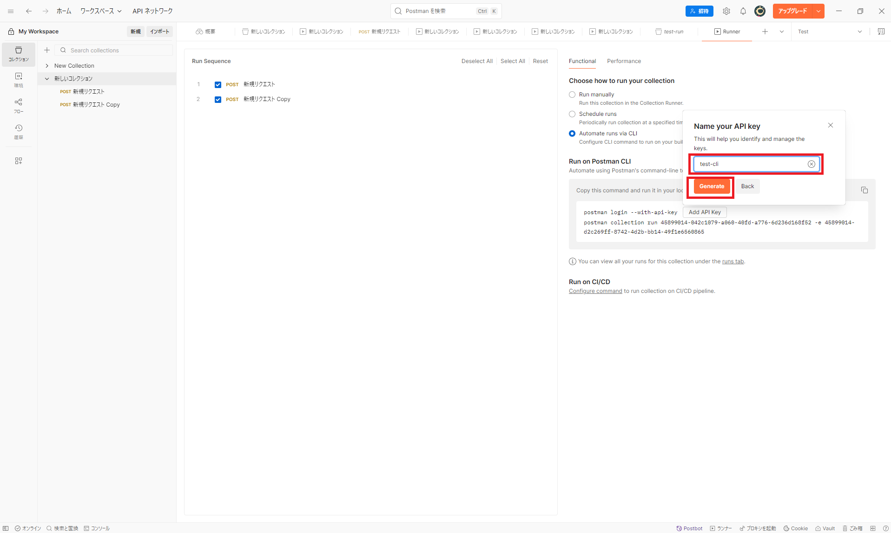

`Insert Key` をクリックすると、`Add API Key`と表記されていた箇所に値が代入される

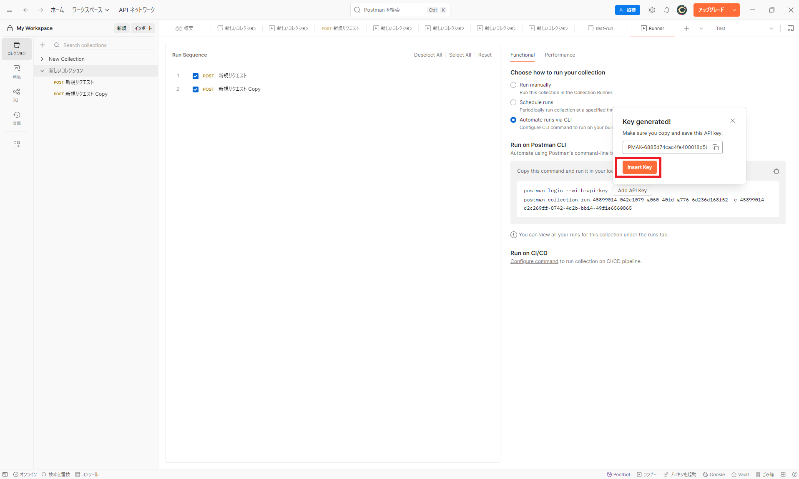

「Copy this command and run it in your local terminal.」の右にある `コピー`ボタンをクリックし内容をコピーする


コマンドラインに戻り、コピーした内容を実行していく。
まず、ログインするためにコピーした内容の中で以下を実行する。

```bash
postman login --with-api-key 「自身のAPI-Key」
```


続いて、コピーした残りの内容を実行していく。しかし、そのままでは失敗してしまう。
これはデータファイルの読込がないからである。そこで、Iteration の回数や読み込むデータファイルのパスを指定しるオプションを指定する必要がある。オプションを追加したコマンドの内容を以下に示す。

> **補足** Postman CLI には、その他にも様々なオプションを設定できるがここでは説明を省略する。詳細は [Postman CLI Command Options](https://learning.postman.com/docs/postman-cli/postman-cli-options/) を参照されたい。

```bash
postman collection run 「実行ID」 -e 「環境ID」 -n 3 -d 「tutorial.csvまでのパス」
```


コマンドラインでの実行結果の下の方に行き、Iteration の回数や テストスクリプトの実行結果を確認することができる。さらに、「View on Postman」の右側に表示されたリンク先を参照すると、Postman の Web アプリケーション上でも実行結果を確認することができる。


#### CI/CD での実行

**Run on CI/CD** の下にある `Configure command` をクリックすると Postman CLI を設定を作成する画面に遷移する。


今回は実行を省略するが、実行したいコレクション、環境、CI/CD Provider の設定や OS 環境を設定することで、設定ファイルの内容が自動で作成されるようになる。

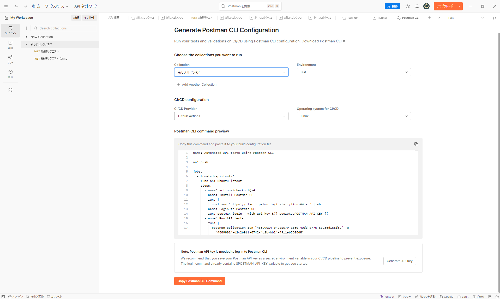

## Performance（性能）テスト

Collection Runner の **Performance** タブを使うと、同じコレクションを複数の仮想ユーザーで並列実行し、実際のトラフィックをシミュレートして API のパフォーマンスを計測できる
