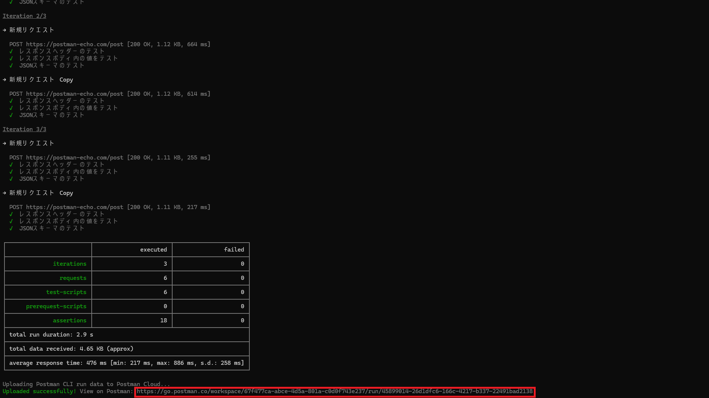

:[表紙](cover.md)

# 目次

- [目次](#目次)
- [1. Postman とは](#1-postman-とは)
- [2. Postman のインストールと言語設定](#2-postman-のインストールと言語設定)
  - [2.1 利用環境](#21-利用環境)
  - [2.2 言語設定](#22-言語設定)
- [3. 基本機能の説明](#3-基本機能の説明)
  - [3.1 ワークスペースの移動](#31-ワークスペースの移動)
  - [3.2 コレクションの作成](#32-コレクションの作成)
  - [3.3 リクエストの作成](#33-リクエストの作成)
  - [3.4 テストスクリプトの作成](#34-テストスクリプトの作成)
  - [3.5 リクエストの実行とテスト結果の確認](#35-リクエストの実行とテスト結果の確認)
  - [3.6 変数の使用](#36-変数の使用)
- [4. Collection Runner を使った自動実行](#4-collection-runner-を使った自動実行)
  - [4.1 事前準備](#41-事前準備)
  - [4.2 Collection Runner の画面へ遷移](#42-collection-runner-の画面へ遷移)
  - [4.3 実行するリクエストの選択と順序](#43-実行するリクエストの選択と順序)
  - [4.4 Functional（機能）テスト](#44-functional機能テスト)
    - [4.4.1 Run manually の実行](#441-run-manually-の実行)
    - [4.4.2 Schedule runs の実行](#442-schedule-runs-の実行)
    - [4.4.3 Automate runs via CLI の実行](#443-automate-runs-via-cli-の実行)
      - [4.4.3.1 CLI 上での実行](#4431-cli-上での実行)
      - [4.4.3.2 CI/CD での実行](#4432-cicd-での実行)
  - [4.5 Performance（性能）テスト](#45-performance性能テスト)
    - [4.5.1 性能テストの設定項目](#451-性能テストの設定項目)
    - [4.5.2 性能テストの実行](#452-性能テストの実行)
- [5. 無料版と有料版の比較](#5-無料版と有料版の比較)
  - [5.1 Postman プラン比較（Free / Basic / Professional / Enterprise）](#51-postman-プラン比較free--basic--professional--enterprise)
  - [5.2 各項目の説明](#52-各項目の説明)

<div class="page"/>

# 1. Postman とは

Postman とは、RESTful API や GraphQL などの Web API を開発・テスト・ドキュメント化・モニタリングするための総合プラットフォームである。  
直感的な操作性と豊富な機能を備え、API テストの効率化やチームでの共同作業を円滑に実施できる。主な特徴を以下にまとめる。

- **直感的なユーザーインターフェース**  
  GUI ベースでリクエスト作成やレスポンス確認が可能。  
  curl コマンドやスクリプトを覚える必要がなく、HTTP メソッド（GET / POST / PUT / DELETE など）やヘッダー、クエリパラメータ、ボディ（JSON / XML、フォームデータ等）の設定が容易である。

- **環境変数・グローバル変数**  
  開発／ステージング／本番など、複数の環境ごとに URL や認証情報、共通パラメータを変数として定義。  
  切り替え一つで同じテストを各環境に対して実行できる。

- **コレクション機能**  
  API リクエストをグループ化し、再利用可能な「コレクション」として保存可能。  
  コレクション単位でテストスクリプトや環境変数を設定でき、テストケースの管理やバージョン管理が容易になる。

- **モックサーバー機能**  
  実際の API 実装が未完成でも、想定レスポンスを返すモックサーバーを作成可能。  
  フロントエンドとバックエンドの並行開発やプロトタイプ検証に役立つ。

- **モニタリング機能**  
  定期的に API を呼び出して応答時間やエラー率を監視できる。  
  SLA（Service Level Agreement） 遵守の確認や障害検知に活用可能。

- **ドキュメント自動生成**  
  コレクションから API ドキュメントを自動生成。  
  実行例付きで公開できるため、利用者が API を試しやすくなる。

- **チームコラボレーション機能**  
  クラウドワークスペースを通じて、リクエストや環境設定、テストスクリプトを共有可能。  
  権限管理やレビュー機能もあり、大規模開発に適している。

- **自動化と CI/CD 連携**  
  Postman CLI を使い、コマンドラインや CI 環境（GitHub Actions / Jenkins 等）でコレクションを実行し、テストパイプラインに組み込める。

<div class="page"/>

# 2. Postman のインストールと言語設定

ここでは、Postman のインストール方法と言語設定について説明する

## 2.1 利用環境

Postman には Web 版とデスクトップ版の両方が存在する。

Web 版：<https://identity.getpostman.com/login>

デスクトップ版：<https://www.postman.com/downloads/>

> **補足：** APIの Performance（性能） をテストする際には、デスクトップ版の環境が必要となる

## 2.2 言語設定

アプリ画面右上から ``Settings（設定）`` を開く
  


``General（一般）`` から Application（アプリケーション）内の Language（言語）で ``日本語`` を選択する


<div class="page"/>

# 3. 基本機能の説明

Postman を使ったAPIテストの基本機能について Postman 内でリクエストのお試しができるサービス [Postman Echo](https://learning.postman.com/docs/developer/echo-api/) を例に挙げて説明する。
<https://postman-echo.com/post> では、ボディ内に記載した内容がそのままレスポンスで返ってくる仕様になっている。

## 3.1 ワークスペースの移動

左上の ``ワークスペース`` から ``My Workspace`` を選択する


## 3.2 コレクションの作成

左上の ``新規`` をクリックし、表示される選択肢から ``コレクション`` をクリックする


「新しいコレクション」という名前でコレクションが作成されたことを確認し、``リクエストを追加`` を選択


## 3.3 リクエストの作成

HTTP リクエストメソッドとして ``POST`` を選択し、URL に <https://postman-echo.com/post> を入力する


``ボディ`` 内の ``Raw`` を選択し、以下の内容を記載する

```json
{
  "company":"MetaMoJi Inc."
}
```


## 3.4 テストスクリプトの作成

``スクリプト`` 内の ``Post-response`` をクリックし、以下の内容を記載する

```javascript
// レスポンスヘッダーの内容をテストするための記述
pm.test("レスポンスヘッダーのテスト", function () {
    pm.expect(pm.response.headers.get("Content-Length")).to.exist;
    pm.expect(pm.response.headers.get('Content-Type')).to.include('application/json');
});

// レスポンスボディ内の内容をテストするための記述
pm.test("レスポンスボディ内の値をテスト", function () {
    const data = pm.response.json().data;
    pm.expect(data.company).to.equal("MetaMoJi Inc.");
});

// レスポンスのJsonスキーマをテストするための記述
const expectedSchema = {
    "type": "object",
    "properties": {
        "data": {
            "type": "object",
            "properties": {
                "comany": {
                    "type": "string"
                }
            }
        }
    }
};
pm.test('JSONスキーマのテスト', function () {
    pm.response.to.have.jsonSchema(expectedSchema);
});
```


## 3.5 リクエストの実行とテスト結果の確認

画面右上の ``送信`` をクリックし、リクエストを実行する。
すると、画面下半分にリクエスト実行結果が表示される。
実行結果の ``ボディ`` からレスポンスのボディにリクエスト時の入力した値が含まれていることが確認できる。


レスポンス結果の項目から ``テスト結果`` をクリックし、先ほど記載したテストが実行されていることを確認する。
「合格」であればテストケースが期待値と一致しており、「不合格」であれば期待された結果ではないことを示す。


## 3.6 変数の使用

変数を使用することで環境ごとに異なるURLを指定したり、リクエストに与えるパラメータを変更したりすることができる。以下に使用可能な変数の一覧を示す。

| スコープ     | 説明                                                                                                                                                                     |
| ------------ | ------------------------------------------------------------------------------------------------------------------------------------------------------------------------ |
| グローバル   | コレクション、リクエスト、テストスクリプト、環境の間でデータにアクセスできるワークスペース全体の変数。テストやプロトタイピングに適する。                                 |
| コレクション | 特定のコレクション内の全リクエストで使用でき、環境には依存しない変数。認証や URL 詳細など、単一環境で使う情報の管理に適する。                                            |
| 環境         | ローカル開発／テスト／運用など、用途ごとに切り替えて使える変数。アクティブ化できる環境は１つのみ。環境ごとにロールベースのアクセス制御を設定可能。                       |
| データ       | 外部 CSV／JSON ファイルから読み込まれ、PostmanCLI や Collection Runner 実行時にデータセットを定義する変数。実行中のみ現在の値を保持し、終了後はクリアされる。                |
| ローカル     | リクエストスクリプト内の一時変数で、単一リクエストまたはコレクション実行中のみ有効。 |

> **補足：** 同じ名前の変数が複数のスコープで宣言されている場合、より狭いスコープ（ローカル→データ→環境→コレクション→グローバル）の値が優先される

実際に変数を用いて [3.5 リクエストの実行とテスト結果の確認](#35-リクエストの実行とテスト結果の確認) で使用したリクエストを実行し、結果が同じになることを確認していく。

1. **環境（Test）を作成**

    左サイドバーに存在する ``環境`` をクリックし、``+`` をクリックする。
    すると、「新しい環境」という名前で環境が作成される。

    

    「新しい環境」の横にある ``･･･`` をクリックし、`` 名前の変更 `` から環境名を「Test」に変更する

    

2. **<https://postman-echo.com> を環境変数 baseUrl として設定**

    変数：baseUrl、タイプ：デフォルト、初期値：<https://postman-echo.com>、現在値：<https://postman-echo.com> を設定する
    

3. **リクエストの実行環境を Test に変更**

    右上にある ``環境なし`` と表示されている箇所をクリックし、表示される環境一覧から「Test」を選択する

    
4. **リクエストの URL を環境変数に変更**

    左サイドバーにある ``コレクション`` から「新規リクエスト」をクリックする。
    そして、リクエスト先として記載されている <https://postman-echo.com> を **{{baseUrl}}** に変更する。

    
5. **リクエストを実行し、レスポンスを確認**

    ``送信`` をクリックし、リクエストを実行する。
    その後、リクエスト結果として下画面に「ボディ」や「テスト結果」が表示される。
    表示された結果を見ると、[3.5 リクエストの実行とテスト結果の確認](#35-リクエストの実行とテスト結果の確認)と同様の結果が得られたことが確認できる。

    

<div class="page"/>

# 4. Collection Runner を使った自動実行

これまでは手動でリクエストについて説明してきた。しかし、リクエストの数やパラメータの数が増加してくると手動での実行はコストがかかる。そこで、本セクションでは「Collection Runner」 を用いたリクエストの自動実行を実現する操作を説明する。

## 4.1 事前準備

1. **データファイルの作成**

    APIのテストを行うにあたり、リクエストを様々なパターンで実行したいと考えるはずだ。
    これは、それらのパラメータを記載したデータファイルをコレクションの実行時に読み込ませることで可能になる。
    以下の内容のデータファイルを **tutorial.csv** として保存しておく。
    データファイルの 1 行が 1 回の Iteration に対応しており、以下のデータファイルでは 3 回の Iteration でそれぞれ異なる値が代入される。

    | companyName   |
    | ------------- |
    | MetaMoJi Inc. |
    | Sample Inc.   |
    | Test Inc.     |

2. **リクエストのボディ内容を変数に変更**

    「新規リクエスト」 のボディの 「company」 の値を **"{{companyName}}"** に置き換える。
    これにより、コレクション実行時にデータファイルから変数「companyName」と一致する変数に値が代入される。
    > **注意：** "{{companyName}}" とダブルクォーテーションで囲むようにする

    

    `スクリプト` から `Post-response` を選択し、レスポンスボディの値をテストするスクリプトを以下に示す記述に置き換える。
    「pm.iterrationData.get("companyName") 」は、データファイルから **companyName** を取得するための記述である。

    ```javascript
    // レスポンスボディ内の内容をテストするための記述
    pm.test("レスポンスボディ内の値をテスト", function () {
        const data = pm.response.json().data;
        pm.expect(data.company).to.equal(pm.iterationData.get("companyName"));
    });
    ```

    

    コレクション実行では複数のリクエストを順序に沿って実行することができる。
    順序の決定方法は、後の[4.3 実行するリクエストの選択と順序](#43-実行するリクエストの選択と順序)で詳しく説明する。
    リクエストの数を増やすために、「新規リクエスト」の右側にある `･･･` から `複製` をクリックし、「新規リクエスト Copy」を作成する。

    

## 4.2 Collection Runner の画面へ遷移

「新しいコレクション」の右にある `･･･` から `実行` をクリックし、Collection Runner の画面へと移る


## 4.3 実行するリクエストの選択と順序

Collection Runner では、実行するリクエストの選択や順序を組み替えることができる。
「新規リクエスト」のみを実行したい場合は、「新規リクエスト Copy」の左にあるチェックマークを外せばよい。一方、「新規リクエスト」と「新規リクエスト Copy」の実行順序を入れ替えたい場合は、「新規リクエスト Copy」の左側にある `ハンバーガーアイコン` をクリックした状態で、「新規リクエスト」の上までドラッグする。


## 4.4 Functional（機能）テスト

Collection Runner の `Functional` タブでは、選択したコレクション内のリクエストを順番に実行し、テストスクリプトを使って API の機能検証を自動化できる

- **Run manually**

    Collection Runner 上で `Run` ボタンをクリックし、その場でコレクションを実行する
  - 開発中の動作確認やデバッグに最適  
  - Iterations（反復回数）や Delay（リクエスト間の遅延）を都度設定可能

- **Schedule runs（定期実行）**  

    Postman Cloud 上で実行スケジュールを設定し、自動的にコレクションを実行
  - 毎日／毎週／指定日時での定期テストに便利
  - 実行結果はダッシュボードで履歴として管理・共有可能  

- **Automate runs via CLI（CLI 自動実行）**  
  
    Postman CLI（Postman の公式 CLI）用のコマンドを生成し、コマンドラインや CI/CD パイプライン（Jenkins、GitHub Actions など）からコレクションを実行
  - スクリプトやビルド環境に組み込むことで、テストの完全自動化を実現
  - 結果は標準出力／ファイル出力に対応し、CI の成功／失敗条件を設定可能

### 4.4.1 Run manually の実行

`Functional` をクリックし、コレクションの実行方法として `Run manually` を選択する


実行の設定として、Iterations に 3 を設定する。
そして、`Select File` をクリックし、[4.1 事前準備](#41-事前準備)で作成した 「tutorial.csv」　を選択する。


Preview 画面で読み込まれたデータファイルが CSV であることと読み込まれた内容が元のデータファイルと一致していることを確認し、`Usu localy` をクリックする。
> **補足：** `Upload to Workspace` を選択した場合、Postman Cloud上にアップロードされる。次回コレクションを実行する際に、アップロードされたデータファイルを使用することができる。


`Run 新しいコレクション` をクリックし、コレクションを実行する


実行の結果が表示されるので、各 Iteration ごとに変数に代入されるパラメータが異なり、それによってレスポンスも異なっていることを確認する


### 4.4.2 Schedule runs の実行

`Functional` をクリックし、コレクションの実行方法として `Schedule runs` を選択する


スケジュールの設定および実行の設定を以下のように設定する。

| 項目          | 設定内容             |
| ------------- | -------------------- |
| Schedule Name | test run             |
| Run Frequency | 時タイマー、1 時間毎 |
| Enviroment    | Test                 |
| Iterations    | 3                    |
| Select file   | tutorial.csv         |

> **補足：** Run Frequency では、分タイマー、時タイマー、週タイマーを設定できる。しかし、無料版では分タイマーは設定できない。

メールの通知の設定では、コレクションの実行が失敗した場合に通知するユーザーの指定と何回連続で失敗した場合に通知を止めるかを設定できる。今回はデフォルト値を使用する。


`Schedule run` をクリックし、コレクションを設定したスケジュールで実行する


スケジュールが設定され、１時間毎にコレクション実行されるようになる


### 4.4.3 Automate runs via CLI の実行

`Functional` をクリックし、`Automate runs via CLI` を選択する

#### 4.4.3.1 CLI 上での実行


コレクションを CLI で実行するために、Postman CLI をインストールする必要がある。

「Run on Postman CLI」の項目にある [Install Postman CLI](https://learning.postman.com/docs/postman-cli/postman-cli-installation/#windows-installation) のリンクをクリックする。


リンク先から自身の実行環境に応じてインストールを行う。
筆者は WSL（Windows Subsystem for Linux） 上で実行するため、Linux環境でインストールを行う。


コマンドライン上で以下のコマンドを実行する。

```bash
curl -o- "https://dl-cli.pstmn.io/install/linux64.sh" | sh
```


Postmanの画面に戻り、`Add API Key`をクリックして `Generate Key` を選択する


API key の名前として test-cli と入力し、`Generate` をクリックする


`Insert Key` をクリックすると、`Add API Key`と表記されていた箇所に値が代入される


「Copy this command and run it in your local terminal.」の右にある `コピー`ボタンをクリックし内容をコピーする


コマンドラインに戻り、コピーした内容を実行していく。
まず、ログインするためにコピーした内容の中で以下を実行する。

```bash
postman login --with-api-key 「自身のAPI-Key」
```


続いて、コピーした残りの内容を実行していく。しかし、そのままでは失敗してしまう。
これはデータファイルの読込がないからである。そこで、Iteration の回数や読み込むデータファイルのパスを指定しるオプションを指定する必要がある。オプションを追加したコマンドの内容を以下に示す。

> **補足：** Postman CLI には、その他にも様々なオプションを設定できるがここでは説明を省略する。詳細は [Postman CLI Command Options](https://learning.postman.com/docs/postman-cli/postman-cli-options/) を参照されたい。

```bash
postman collection run 「実行ID」 -e 「環境ID」 -n 3 -d 「tutorial.csvまでのパス」
```


コマンドラインでの実行結果の下の方に行き、Iteration の回数や テストスクリプトの実行結果を確認することができる。さらに、「View on Postman」の右側に表示されたリンク先を参照すると、Postman の Web アプリケーション上でも実行結果を確認することができる。




#### 4.4.3.2 CI/CD での実行

**Run on CI/CD** の下にある `Configure command` をクリックすると Postman CLI を設定を作成する画面に遷移する。


今回は実行を省略するが、実行したいコレクション、環境、CI/CD Provider の設定や OS 環境を設定することで、設定ファイルの内容が自動で作成されるようになる。


## 4.5 Performance（性能）テスト

Collection Runner の **Performance** タブを使うと、同じコレクションを複数の仮想ユーザーで並列実行し、実際のトラフィックをシミュレートして API のパフォーマンスを計測できる。

### 4.5.1 性能テストの設定項目

以下では性能テストにおける各項目について説明していく。


- **負荷プロフィール**

    | プロフィール | 説明                                                                                         |
    | ------------ | -------------------------------------------------------------------------------------------- |
    | 固定         | 全テスト時間を通して、一定数の仮想ユーザーを維持                                             |
    | ランプアップ | テスト開始時は少ない仮想ユーザーから始め、時間経過とともに徐々に増加                         |
    | スパイク     | 短時間で急激に仮想ユーザー数を増加させ、APIの瞬間的な負荷体性を確認                          |
    | ピーク       | ユーザー数を増やしピークを作った後に減らすパターン（利用者数が変動するシナリオの検証に使用） |

- **仮想ユーザー数とテスト時間**
  - 仮想ユーザー

    テスト中に同時接続をシミュレートする人数。例えば、20 に設定すれば、常に　20　人分のリクエストが並行して送信される。

  - テスト時間
  
    テストを継続する時間（分単位）。例えば 10 に設定すると 10 分間テストを実行する。

- **データファイル**
  
    「データファイル」オプションを利用すると、CSVやJSON形式でテスト用データを読み込み、各仮想ユーザーが異なる入力データでリクエストを送信できる。

- **テスト合格条件**
  
    パフォーマンステストが成功とみなされるための閾値を定義する機能

    | 項目                   | 説明                                                | 例        |
    | ---------------------- | --------------------------------------------------- | --------- |
    | 平均応答時間           | 仮想ユーザ全体での平均レスポンス時間                | < 500ms   |
    | パーセンタイル応答時間 | 全体の何%のリクエストがこの時間以下で完了している必要があるか | < 800ms   |
    | エラー率               | 全リクエストに対する失敗リクエストの割合            | < 1%      |
    | スループット           | 1 秒あたりの成功リクエスト数                        | > 100 RPS |

### 4.5.2 性能テストの実行

ここでは、負荷プロフィールを「固定」にした設定で性能テストを実行する例を紹介する。

各設定項目に以下の内容を指定する。

| 項目             | 設定内容           |
| ---------------- | ------------------ |
| 負荷プロフィール | 固定               |
| 仮想ユーザー     | 3                  |
| テスト時間       | 1 分               |
| ファイル選択     | tutorial.csv       |
| テスト合格条件   |                    |
| Metric           | Avg. Response Time |
| Condition        | is less than       |
| Value            | 500 ms             |


上記の設定で実行すると性能テストが開始され、結果がリアルタイムで表示される。
テストの結果、レスポンスタイムの平均が 318ms となり、テスト合格条件である 500ms 未満を満たすことから Pass（成功）という判定となっている。


<div class="page"/>

# 5. 無料版と有料版の比較

ここでは、Postman の料金プランによる使用可能な機能・特徴についてまとめている。

## 5.1 Postman プラン比較（Free / Basic / Professional / Enterprise）

| プラン         | 月額（年間払い）             | 主な機能・特徴 |
|----------------|-------------------------------|----------------|
| **Free**       | \$0                             | - 最大3名の共同作業<br> - API Client<br> - パッケージ保存数：3<br> - コレクション復旧：1日<br> - Spec Hub：非公開API ×1、公開API 無制限<br> - Flowsアクセス<br> - Postbot活動：50／月<br> - Mock／Monitorリクエスト：1,000回／月<br> - **Collection Run（手動実行）上限：25回／月** |
| **Basic**      | \$14／ユーザー／月（年払い）     | - Freeの機能すべて<br> - コラボレーター無制限<br> - コレクション復旧：30日<br> - Spec Hub：非公開API ×3<br> - Mock／Monitorリクエスト：各10,000回／月<br> - **Collection Run上限：Freeと同じく25回／月**（新モデル）|
| **Professional** | \$29／ユーザー／月（年払い）     | - Basicの機能すべて<br> - プライベートワークスペース<br> - Partner Workspaces（Single & Multi）<br> - 基本的なロールベースアクセス制御<br> - パッケージ保存数：25<br> - コレクション復旧：90日<br> - Spec Hub：非公開API ×10<br> - **Collection Run上限：250回／月（既存チーム）または25回／ユーザー／月（新モデル）** |
| **Enterprise** | \$49／ユーザー／月（年払いのみ） | - Professionalの機能すべて<br> - Private API Network（社内ディレクトリ）<br> - SSO／SCIM／SAML対応<br> - レポート & 分析機能付き<br> - 監査ログ（Audit Logs）<br> - ユーザーグループ管理<br> - 高度なアクセス制御（Super Admin など）<br> - パッケージ保存数：100<br> - Mockリクエスト：100,000回／月<br> - Monitorリクエスト：10,000回／月<br> - Spec Hub：非公開・公開API 無制限<br> - カスタマーサクセス（専用支援）<br> - **Collection Run上限：無制限**  |

---

## 5.2 各項目の説明

- **API Client**

  Postmanの中心機能で、REST / GraphQL / WebSocket などのAPIに対してリクエストを送信し、レスポンスを確認できるツール。APIの動作確認、開発、デバッグの基盤となる。

- **パッケージ（Package）**

  API仕様書や関連するコレクション、モック、モニターなどのアセットをまとめた単位。保存可能数はプランによって制限があり、大規模プロジェクトやAPI資産が多い場合は上位プランで容量を拡張できる。

- **Spec Hub**

  API仕様（OpenAPI / AsyncAPI）をPostman上で設計・管理する機能。  

  - ビジュアル/コードエディタ対応  
  - API仕様とPostman Collectionの自動同期  
  - ガバナンスルールによる仕様品質チェック  
  - プランによって保存可能な非公開API仕様数が異なる（Enterpriseは無制限）

- **Flows**

  ドラッグ＆ドロップのビジュアルエディタで、複数のリクエストやロジックを組み合わせて処理を自動化する機能。

- **Postbot**

  Postman内での作業を支援するAIアシスタント。リクエスト作成やテストスクリプト生成、ドキュメント化を補助する。利用回数はプランごとに制限あり。

- **Collection Run（手動実行）**

  PostmanのUIからまとめてリクエストを実行する機能。  

  - Free / Basic：25回／ユーザー／月  
  - Professional：旧モデル250回／チーム／月、新モデル25回／ユーザー／月  
  - Enterprise：無制限

  > **補足：** Monitor（Schedule runs）やCLI（PostmanCLI等）経由の実行はこの制限に含まれない。

- **Mockサーバー**

  APIが未実装でもレスポンスを返すテスト用エンドポイントを提供する機能。プランごとに月間リクエスト数の上限がある。

- **Monitor（Schedule runs）**

  APIの動作やレスポンスを定期的にチェックする自動実行機能。モニターで送信されるリクエスト数にも月間上限が設定されている（Freeプランは実行時間上限のみ）。

- **プライベートワークスペース**

  招待されたメンバーのみがアクセスできるワークスペース。  
  同じチーム内でも招待されていないメンバーはアクセスできないため、開発中の機密APIや限定的なコラボレーションに適している。Professionalプラン以上で利用可能。

- **Private API Network**

  Enterpriseプランで利用可能な社内APIディレクトリ機能。組織内のAPI資産を一元管理し、検索やアクセス制御を行える。

---
